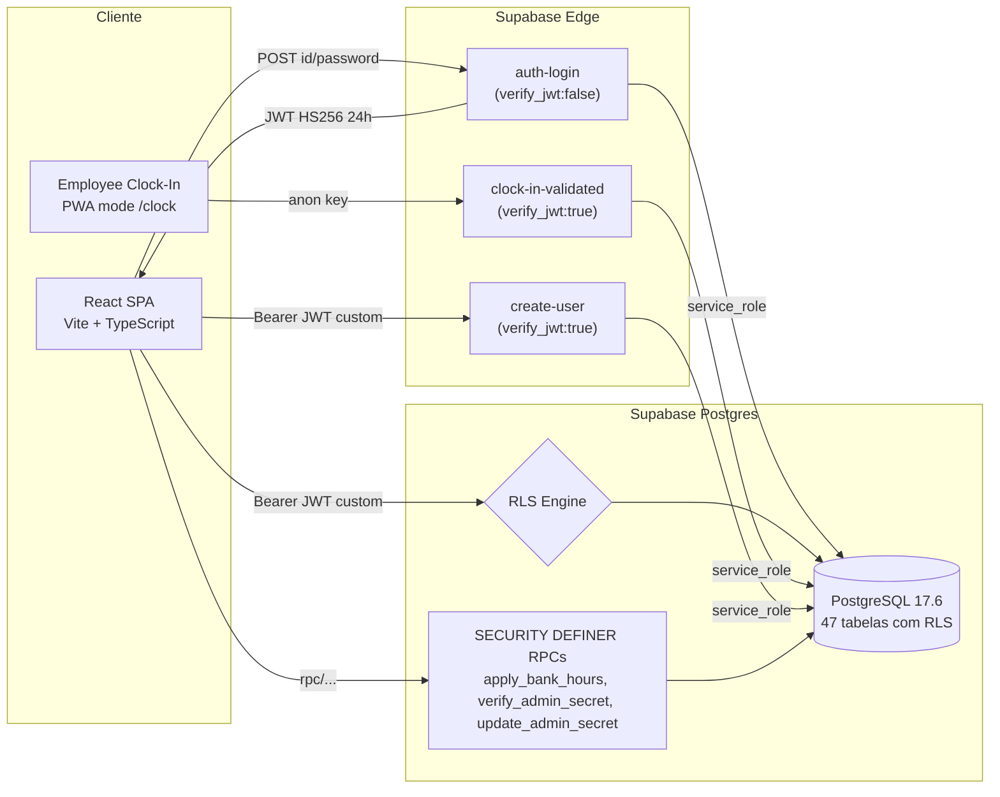
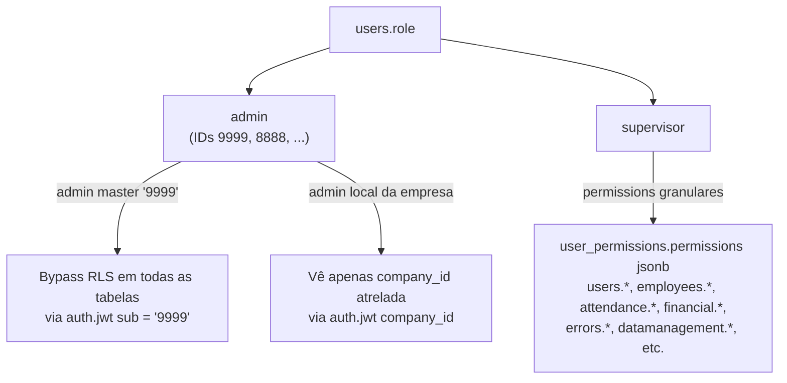
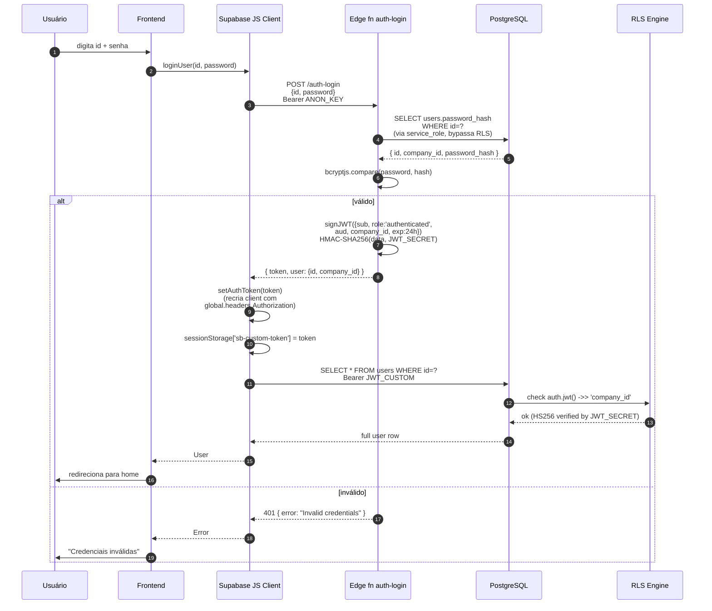
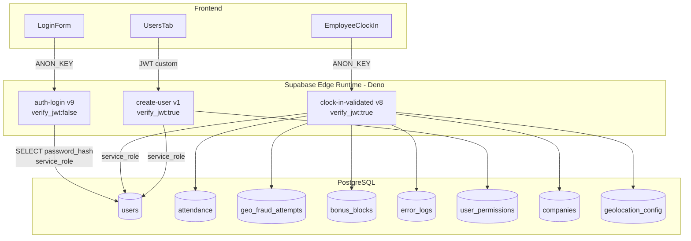
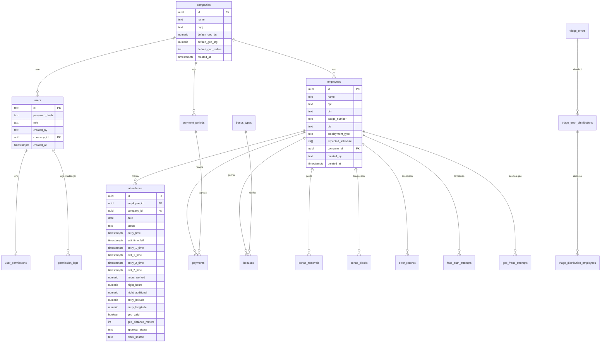
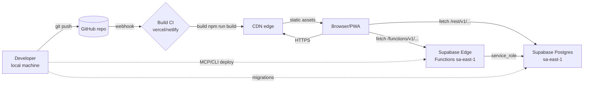

# Architecture — Sistema de Ponto

> Documento de arquitetura canônico. Reflete o estado pós-Fase 11 (multi-tenant RLS + bcrypt + JWT custom).
> Última atualização: 2026-05-12 (sub-fase 12.4).

---

## Sumário

1. [Visão geral](#1-visão-geral)
2. [Multi-tenancy](#2-multi-tenancy)
3. [Fluxo de autenticação](#3-fluxo-de-autenticação)
4. [Row Level Security](#4-row-level-security)
5. [Edge Functions](#5-edge-functions)
6. [Modelo de dados](#6-modelo-de-dados)
7. [Topologia de deployment](#7-topologia-de-deployment)
8. [Decisões arquiteturais (ADRs)](#8-decisões-arquiteturais-adrs)
9. [Referências cruzadas](#9-referências-cruzadas)

---

## 1. Visão geral

Sistema de controle de ponto **multi-tenant** com 100% do backend em Supabase (PostgreSQL + Edge Functions). Frontend single-page React + TypeScript, deployável em qualquer hosting estático.

### Componentes principais



### Stack resumo

| Camada | Tecnologia |
|---|---|
| Frontend | React 18.3 + TypeScript 5.5 + Vite 5.4 + Tailwind 3.4 |
| Hosting | Estático (Vercel/Netlify/qualquer) |
| Backend API | Supabase REST (gerado pelo PostgreSQL) |
| Backend lógica custom | Supabase Edge Functions (Deno) |
| Banco | PostgreSQL 17.6 hospedado Supabase sa-east-1 |
| Auth | JWT custom HS256 emitido por edge fn (sem Supabase Auth padrão) |
| Hash de senhas | bcrypt $2a$10$ via `https://esm.sh/bcryptjs@2.4.3` |
| Testes | Vitest 4 (unit, 422 tests) + Playwright 1.59 (E2E, 35+ specs) |

---

## 2. Multi-tenancy

### Modelo

**Soft multi-tenancy** com `company_id` (uuid) em todas as tabelas operacionais. Cada empresa é uma row em `companies`. Não há schemas separados, databases separados ou row partitioning explícito — isolation é puramente lógico via RLS.

### Empresas em produção

| Empresa | UUID | Status |
|---|---|---|
| **Caratinga** (CLAYTON B DOS SANTOS) | `6583bb2a-e334-41a7-b69c-7d98f3b46dfc` | Operação ativa — ~30 employees, ~3130 attendances, ~1722 payments |
| **Ponte Nova** (CD LOGISTICA LTDA) | `2b2abc4b-084c-4cf0-b5f1-02792513241d` | Onboarding — 1 admin user (8888), demais dados pendentes |

### Roles



### Switcher de empresa

Apenas admin master pode trocar de empresa em runtime — UI em `CompanySwitcher` (header).

- Persistência: `localStorage['sistema_ponto_company_id']`
- O JWT em si **não** é re-emitido — `auth.jwt() ->> 'company_id'` continua sendo o do login. O switch afeta apenas o UI/state (`CompanyContext`), e como admin master tem bypass nas policies, ele continua vendo todas as tabelas.

Supervisor: empresa atrelada via `users.company_id` (NOT NULL, default Caratinga). Frontend usa o `company_id` retornado do `auth-login`.

---

## 3. Fluxo de autenticação

### Sequence diagram completo



### Detalhes operacionais

- **JWT_SECRET** é o "JWT Secret" oficial do projeto Supabase (Settings → API → JWT Settings). Configurado no Edge Function Secrets pra `auth-login` poder assinar tokens que o PostgreSQL valida nativamente.
- **Persistência de sessão:** `sessionStorage` (não `localStorage`) — token some quando aba fecha. Logout explícito via `clearAuthToken`.
- **Client mutável:** `src/lib/supabase.ts` usa Proxy pra que `import { supabase }` resolva dinamicamente o client atual. Quando `setAuthToken` é chamado, o client subjacente é trocado e todos os imports vêem o novo header.
- **Refresh de token:** não implementado. Expira em 24h — usuário re-faz login. Aceitável pro caso de uso (admin/supervisor não usam o sistema continuamente além de 24h sem fechar aba).

---

## 4. Row Level Security

### Pattern canônico

Todas as 32 tabelas core seguem o mesmo template:

```sql
ALTER TABLE public.<tabela> ENABLE ROW LEVEL SECURITY;

CREATE POLICY "<tabela>_select" ON public.<tabela>
  FOR SELECT TO public
  USING (
    company_id = (auth.jwt() ->> 'company_id')::uuid
    OR (auth.jwt() ->> 'sub') = '9999'
  );

CREATE POLICY "<tabela>_insert" ON public.<tabela>
  FOR INSERT TO public
  WITH CHECK (
    company_id = (auth.jwt() ->> 'company_id')::uuid
    OR (auth.jwt() ->> 'sub') = '9999'
  );

-- update + delete análogos
```

74 policies dormentes foram criadas na sub-fase 11.2 e ativadas atomicamente na 11.1 (cutover ENABLE RLS + DROP password plain numa migration única — evita janela de incosistência).

### Exceções estruturais

| Tabela | Policy especial | Motivo |
|---|---|---|
| `companies` | `SELECT TO public USING (true)` | Frontend precisa listar empresas pré-login (CompanySelector) |
| `admin_secret` | DENY ALL | Acesso apenas via RPC `verify_admin_secret` / `update_admin_secret` (SECURITY DEFINER) |
| `error_logs` | `company_id IS NULL` aceito | Edge fns podem logar erros sem company_id resolvido ainda |
| 7 admin-only | Sem clause company_id, apenas `sub = '9999'` | activity_logs, audit_logs, cleanup_logs, etc. são globais |

### Garantias

- ✅ Login com supervisor da Caratinga: vê apenas dados Caratinga.
- ✅ Login com supervisor de Ponte Nova: vê apenas dados Ponte Nova.
- ✅ Login com admin master '9999': vê todas as empresas (bypass).
- ✅ Sem login (anon key): vê apenas `companies` SELECT — todas as outras tabelas bloqueadas.

### Validação

Audit trail completo em `docs/security-baseline-post-rls.md`. Specs E2E `25-multi-company-isolation` + `26-multi-company-ui-isolation` validam empiricamente.

---

## 5. Edge Functions

### Topologia



Detalhes de cada edge fn em [`docs/edge-functions.md`](docs/edge-functions.md).

### Por que edge functions em vez de RPCs PL/pgSQL?

| Edge fn | Por que não RPC? |
|---|---|
| `auth-login` | Precisa de bcrypt — Postgres tem `pgcrypto.crypt`, mas o ecossistema bcryptjs é mais estabelecido + permite migração futura pra outros backends |
| `clock-in-validated` | Lógica geo (Haversine), business rules (entry/exit, marking_position 1-4), múltiplos writes com error logging best-effort |
| `create-user` | bcrypt + permission check em jsonb |

RPCs PL/pgSQL (SECURITY DEFINER) são usadas onde a lógica é puramente SQL:
- `apply_bank_hours_to_payment` — transacional, múltiplos UPDATEs encadeados
- `verify_admin_secret`, `update_admin_secret` — bcrypt via `pgcrypto.crypt(input, hash) = hash`

---

## 6. Modelo de dados

### Diagrama ER simplificado (core)



### Convenções

- **PK:** uuid (gerada por `gen_random_uuid()` ou `uuid_generate_v4`) — exceto `users.id` que é text (ID numérico user-facing).
- **FK:** `company_id` (uuid) em todas as tabelas operacionais, com default Caratinga pra inserts esquecidos.
- **Timestamps:** `created_at timestamptz DEFAULT now()`. Soft-delete não usado — DELETE é hard.
- **JSONB:** apenas `user_permissions.permissions` (estrutura modular).
- **Constraint single-row per period:** `UNIQUE(employee_id, date)` em attendance; `UNIQUE(employee_id, week_start)` em bonus_blocks; `UNIQUE(company_id)` em admin_cleanup_config (lazy-create pattern, sub-fase 7.2).

### Tabelas legado (15) — isolar

Compartilham o projeto Supabase mas pertencem ao produto "Objetos Perdidos":
`drivers`, `lost_evidence`, `lost_proof_images`, `lost_proof_requests`, `lost_reports`, `route_groups`, `route_mapping`, `routes`, `driver_overrides`, `driver_route_links`, `ai_reports`, `city_cache`, `dashboard_meta`, `search_history`, `tickets`.

**Não tocar** — políticas RLS próprias (RLS-always-true semelhantes a public access), apenas isolated por convenção. Backup_* tables foram dropadas na sub-fase 11.0.

---

## 7. Topologia de deployment



### Variáveis de ambiente

| Local | Variável | Necessária pra |
|---|---|---|
| `.env` (frontend) | `VITE_SUPABASE_URL` | runtime |
| `.env` (frontend) | `VITE_SUPABASE_ANON_KEY` | runtime |
| `.env` (frontend) | `SUPABASE_SERVICE_ROLE_KEY` | apenas testes E2E (`tests/cleanup.ts:getClient`) |
| Supabase Dashboard | `JWT_SECRET` (Edge Function Secret) | `auth-login` assinar tokens |

### Smoke test pós-deploy

```bash
# 1. Frontend serve?
curl -I https://<seu-dominio>/

# 2. Login admin funciona?
curl -X POST "$SUPABASE_URL/functions/v1/auth-login" \
  -H "Content-Type: application/json" \
  -H "apikey: $ANON_KEY" -H "Authorization: Bearer $ANON_KEY" \
  -d '{"id":"9999","password":"<senha>"}' | jq

# 3. Lista tabelas via service_role responde?
# (no Supabase Dashboard SQL Editor)
SELECT COUNT(*) FROM companies;
```

---

## 8. Decisões arquiteturais (ADRs)

Decisões D1-D6 foram tomadas durante a refatoração multi-empresa (Fases 7-11). Todas validadas com Victor e implementadas.

### D1 — Cálculo de `nightCreditMinutes` (sub-fase 8.3)

**Contexto:** Antes da Fase 8, `nighttime_minutes` era calculado independentemente de horas worked totais — gerando dupla-contagem em alguns cenários.

**Decisão:** **C — Diurno primeiro** — calcula primeiro `daytimeMinutes` no shift, depois `nighttimeMinutes` é o resíduo após 22:00 e antes de 05:00 BRT.

**Status:** ✅ Implementado em `src/utils/attendanceCalc.ts:computeNighttimeMinutes`. `nightDebitMinutes = 0` (decisão técnica conservadora — não aplica multiplier noturno a débitos).

### D2 — `admin_cleanup_config` strategy (sub-fase 7.2 + 7.2.1)

**Contexto:** Tabela tinha apenas 1 row global, mas sistema virou multi-tenant.

**Decisão:** **ES — Estrutural** — `UNIQUE(company_id)` + lazy-create no primeiro acess via UPSERT. Sem migration de backfill (config default é criada on-demand).

**Status:** ✅ commits `19a72f3`, `0840f9c`.

### D3 — RLS strategy (sub-fase 11.2 + 11.1)

**Contexto:** Sistema usa login custom (não Supabase Auth). RLS policies precisam validar empresa de forma confiável.

**Opções:**
- A — Session-based (`current_setting('app.current_company_id')`)
- B — RPC-only (todas as queries via RPC com `SECURITY INVOKER`)
- **C — JWT custom HS256** assinado com JWT_SECRET oficial

**Decisão:** **C** — JWT custom HS256. Aceito pelo Postgres porque o secret é o JWT Secret oficial. Policies leem `auth.jwt() ->> 'company_id'`.

**Trade-offs aceitos:**
- ➕ Sem mudança no padrão do client supabase-js (`global.headers.Authorization`)
- ➕ Cada request REST trafega o token uma vez
- ➕ Validação nativa do Postgres (sem RPC overhead)
- ➖ JWT_SECRET precisa estar em Edge Function Secrets (manual setup)
- ➖ Re-issue do token via login pra refresh

**Status:** ✅ commits `27b7796`, `23dc365`. JWT_SECRET configurado em 2026-05-12.

### D4 — Hash de senhas (sub-fase 11.3)

**Contexto:** Coluna `users.password` plain text era ERROR de segurança (advisor `sensitive_columns_exposed`).

**Opções:**
- A — `pgcrypto.crypt('bf', 10)` direto no Postgres
- **B — Edge fn `auth-login` com `bcryptjs.compare`**

**Decisão:** **B** — Edge fn com bcryptjs. Mesmo padrão usado depois pelo `create-user` (sub-fase 11.7).

**Razões:**
- Ecossistema bcryptjs amplamente testado
- Edge fn pode validar credentials sem expor o hash via REST
- Permite migração futura pra outros backends

**Status:** ✅ commit `41bd25c`.

### D5 — `error_logs` adicionar `company_id` (sub-fase 7.4)

**Contexto:** `error_logs` herdada do single-tenant não tinha company_id, dificultando auditoria multi-empresa.

**Decisão:** **A — Sim, adicionar** (NULLABLE — edge fns podem logar sem company_id resolvido).

**Status:** ✅ commit `b2a1bbb`.

### D6 — `bonus_defaults` legacy (sub-fase 7.3)

**Contexto:** Tabela legacy com defaults globais de bônus, substituída pela `bonus_types` por empresa.

**Decisão:** **C — Drop após validar callers**. Backup salvo em `docs/bonus_defaults_legacy_dump_2026-05-11.json`.

**Status:** ✅ commit `73d7649`.

### Regras de qualidade (Regras 1-8 do CHECKPOINT)

Regras canônicas que guiam toda mudança técnica. Quebrar = incidente.

1. **Validar tudo real** via MCP (pre + post)
2. **Sem quebra-galhos** (`as any` sem doc, hardcoded company_id, mock sem branch real)
3. **Uma sub-fase = um commit atômico** com co-author
4. **Teste falhou → mostrar Victor antes de "ajustar"**
5. **TECH_DEBT é canônico** — toda descoberta vira entry
6. **Decisões produto/semântica sempre com Victor**
7. **Padrão idiomático** — ID numérico+senha, company_id param, useEffect/useCallback corretos
8. **Qualidade > velocidade** — nunca economizar pre-check; defensa contra "atalho que vira bug latente"

Detalhes em [`CHECKPOINT.md`](.claude-checkpoints/CHECKPOINT.md).

---

## 9. Referências cruzadas

| Arquivo | Conteúdo |
|---|---|
| [`CHECKPOINT.md`](.claude-checkpoints/CHECKPOINT.md) | Estado de retomada, 8 regras, fases concluídas, fluxo de auth detalhado |
| [`TECH_DEBT.md`](TECH_DEBT.md) | Bugs ativos + características aceitas + histórico de resoluções |
| [`PRE-LAUNCH-CHECKLIST.md`](PRE-LAUNCH-CHECKLIST.md) | Checklist pré go-live (sub-fase 13) |
| [`docs/edge-functions.md`](docs/edge-functions.md) | Referência canônica das 3 edge fns |
| [`docs/security-baseline-pre-rls.md`](docs/security-baseline-pre-rls.md) | Snapshot advisors pré-Fase 11 (67 ERRORs) |
| [`docs/security-baseline-post-rls.md`](docs/security-baseline-post-rls.md) | Snapshot advisors pós-Fase 11 (0 ERRORs Sistema de Ponto) |
| [`README.md`](README.md) | Overview, stack, comandos, suporte |

---

*Documento mantido por Victor + Claude Opus 4.7. Última atualização: 2026-05-12 (sub-fase 12.4).*
